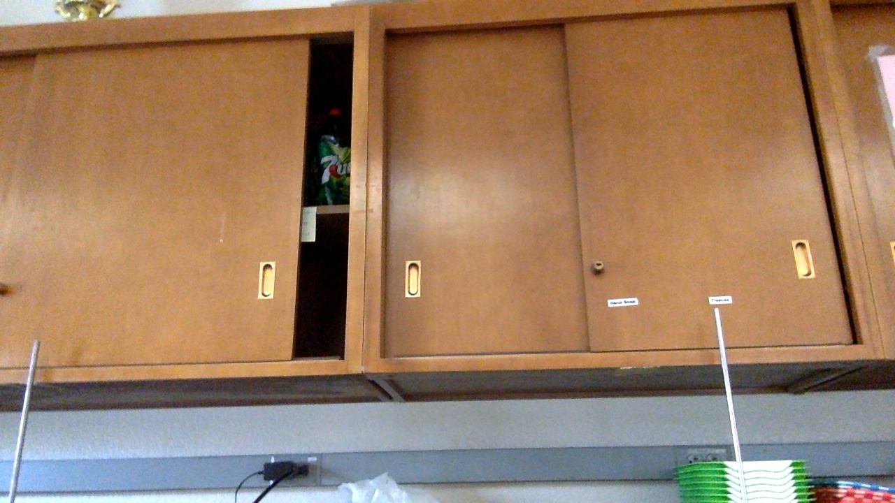
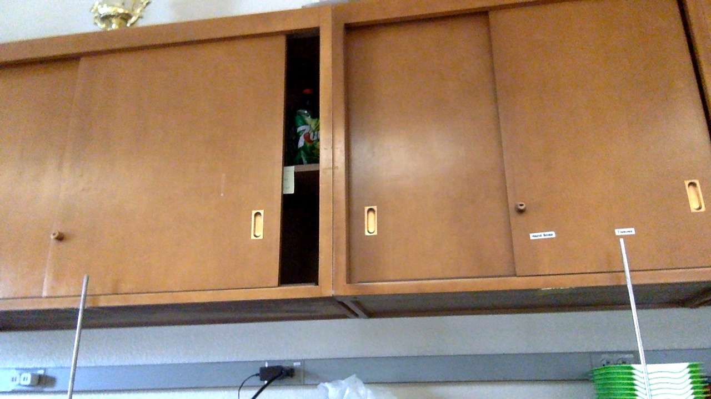

# visual-odom

An attempt at implementing visual odometry in Python. Very early stages: just takes two images, `t.jpg` and `t+1.jpg`, and computes how main features have shifted between the two images. The next step would be to infer a change in the camera's position based on this change in apparent position of main features.

Written in Python. Uses NumPy, OpenCV, and Matplotlib. I used [this blog](https://avisingh599.github.io/vision/monocular-vo/) to learn more about visual odometry and how it might be implemented in code.

## Images

    
    

The images above are `t.jpg` and `t+1.jpg`. They are meant to represent consecutive frames from a camera that is in motion. In this case, the motion is a rough counter-clockwise rotation of the camera (objects are seen to move from left to right).

The program's result is as shown below.

    

Certain points have been identified as 'important' between the two images. The shift in their apparent position has been traced by the multicolor lines in the image.

As mentioned above, the next step (certainly the more difficult step) is to infer a shift in the position of the camera itself from the data above.